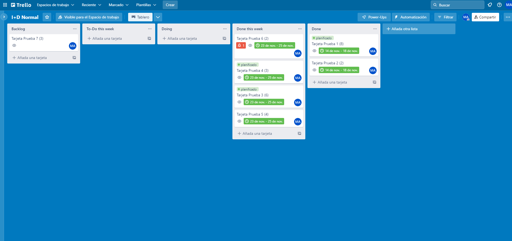

## Description

- Google app script to get kpis from trello boards

## Usage

- Put "kpis-apps-sheet.xlsx" file in google drive.
- Open it and create a new google app script with "kpis-apps-script.js".
- Create a new trello board based on the next image.

- Load your trello credentials on the script and then run it.
